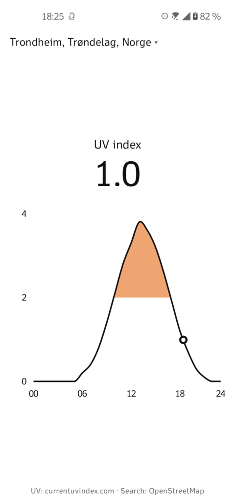

[](https://fyhn.semaphoreci.com/projects/sunburn)


# Sunburn

An Android app that shows today's UV index:



## Build & run

Requires Android SDK with platform 35 and JDK 17.

```bash
./gradlew installDebug
```

## Data

- UV index: [currentuvindex.com](https://currentuvindex.com) (CC BY 4.0)
- Location search: [Nominatim](https://nominatim.openstreetmap.org/) / OpenStreetMap (ODbL)
